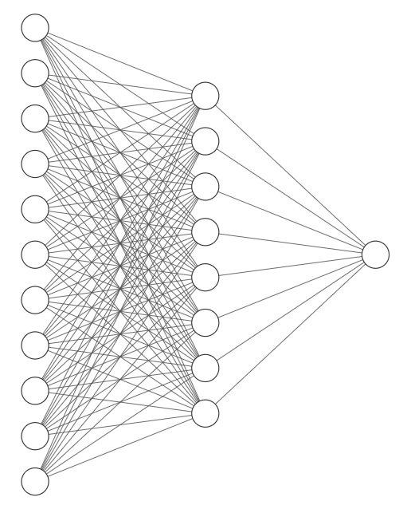
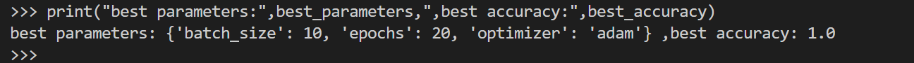

<i>

# SIMPLE RAINFALL PREDICTION 

</i>
Rain Prediction using Artificial Neural Network
<i>

# Data

</i>
The 'csv' file basically contains 5 columns: 'Date','Precipitation','Max Temp','Min Temp','Rain'. 
It consists of 25551 rows of data.
<i>

# Data Cleaning

</i>
The data has missing values which are removed at an early stage. 
<i>

# Preparing Data 

</i>
The columns 'Precipitation','MaxTemp','MinTemp' are the variables on which the 'Rain' depends. So they are separated out. The output column i.e. 'Rain' is made binary(1=yes or 0=no). 
Then the data is splitted into training set and test set with a test set size of 0.3 times the original size i.e. 10220 data points.
<i>

# Feature Scaling 

</i>
The data is normalized using StandardScaler method.
<i>

# Architecture of the Model

</i>
> The model has an input layer of 32 nodes.
> A hidden layer with 16 nodes.
> An output layer with 1 node which produces 1 for rain and 0 for no rain.

<i>

# Compilation and Fitting 

</i>
The model is compiled using adam optimizer. 
The model is trained on a batch size of 20 and for 10 epochs.

<i>

# Prediction

</i>
For prediction, a threshold value of 0.5 is used. It means: 
> If prediction is greater than 0.5, then rain is predicted to happen.
> Otherwise there is no chance of rain according to the prediction.

<i>

# TUNING OF NEURAL NETWORK

</i>
The accuracy of neural model varies on varying the hyperparameters(epochs,batch size,optimizer etc). Hence a bunch of these hyperparameters are tested and the final result is computed for best accuracy and printed.

    

